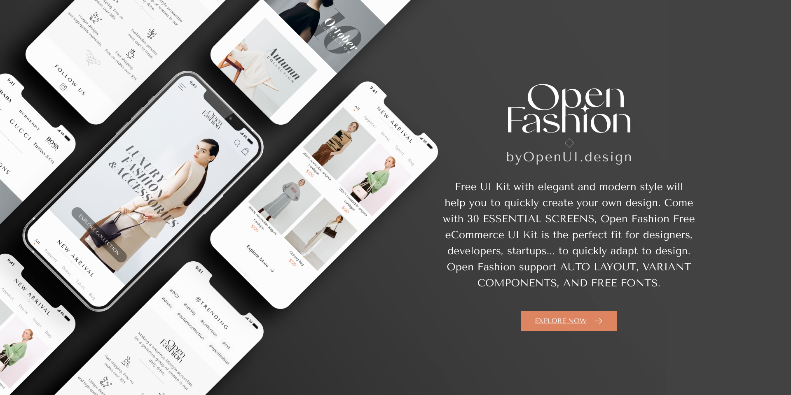
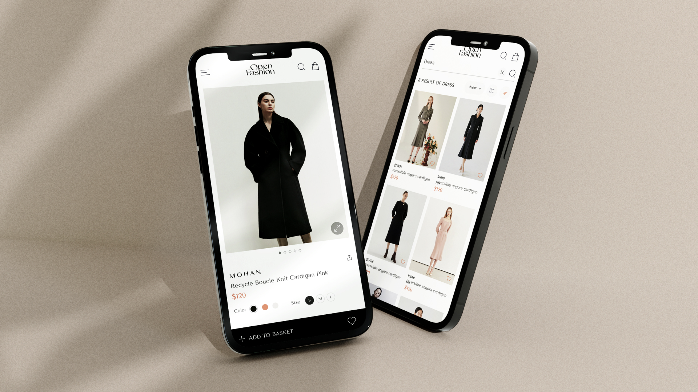
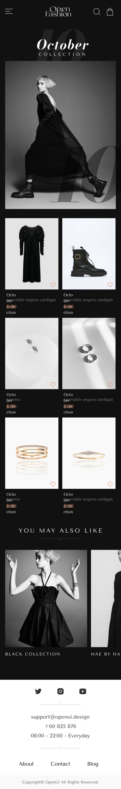
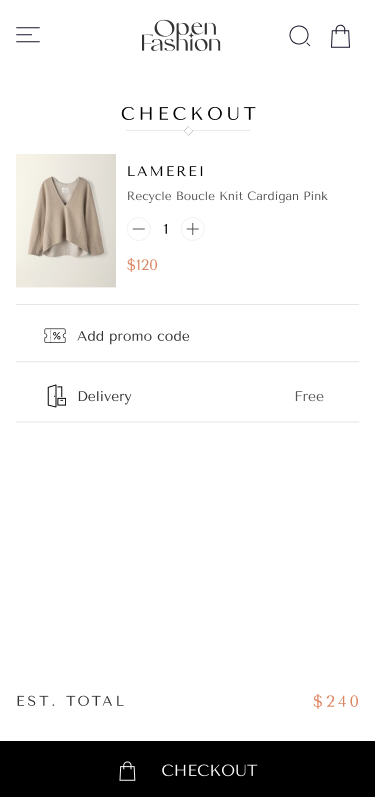
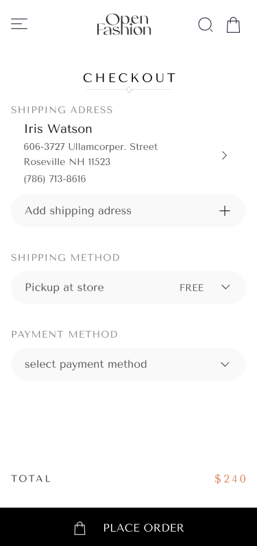
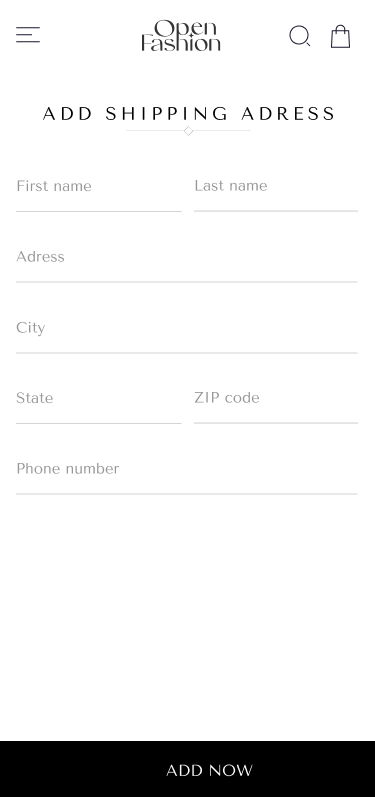
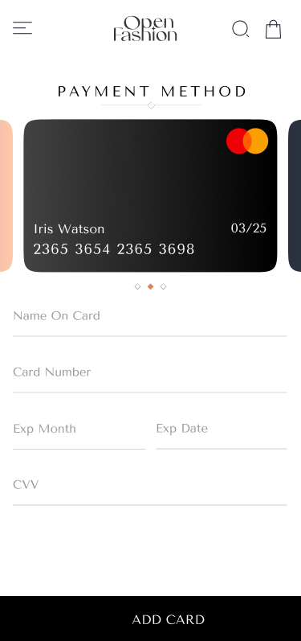
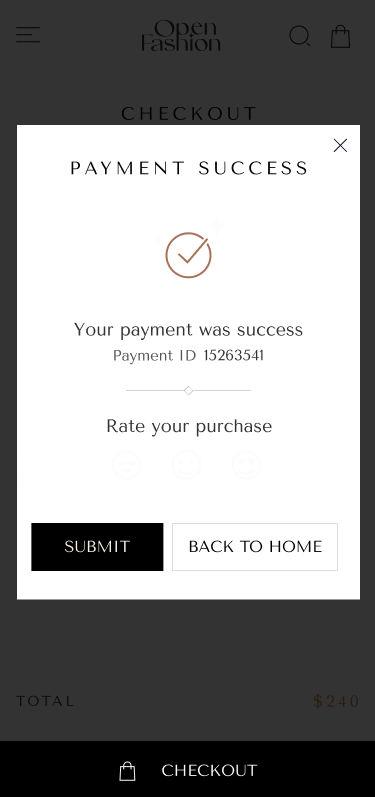

# 👗 Open Fashion Flutter App

<p align="center">
  
</p>

<div align="center">

## ✨ A Modern Fashion Shopping Experience Built with Flutter

**Open Fashion** is a modern and elegant fashion shopping application built with **Flutter**, designed to provide a smooth and premium e-commerce experience.

The application focuses on clean layouts, minimal typography, reusable UI components, fashion products, a streamlined checkout process, and a simple payment flow.


</div>

---

# 📌 Overview

<p align="center">
  
</p>


**Open Fashion** is a Flutter-based fashion shopping application that provides users with a complete shopping journey — from exploring the home screen to successfully placing an order.

The interface follows a modern and minimal fashion-oriented design system with clean spacing, elegant typography, product-focused layouts, and reusable components.

The project focuses on creating:

* 👗 Modern fashion-inspired UI
* 🎨 Clean and minimal design
* 🧩 Reusable Flutter components
* 📱 Responsive layouts
* 🛍️ Smooth shopping experience
* 💳 Simple checkout and payment flow
* ✨ Premium fashion e-commerce experience

---

# 🎨 Figma Design

The application UI is based on the **Open Fashion Free eCommerce UI Kit** design.

🔗 **Figma Project:**
[Open Fashion — Figma Project](https://www.figma.com/design/CGQpIVfb1nrXbZys9Iwus6/Open-Fashion---Free-eCommerce-UI-Kit--Community-?node-id=0-1&p=f&t=e4P2OICucMwh00Ua-0&utm_source=chatgpt.com)

---

# ✨ Features

## 🏠 Home Screen

* Modern fashion-focused home interface.
* Featured fashion products and collections.
* Clean product presentation.
* Promotional content and banners.
* Easy navigation to the shopping experience.

## 🛒 Checkout Screen

* Review selected products before ordering.
* Display order summary.
* Manage shipping information.
* Select payment method.
* Calculate the final order total.

## 📦 Place Order Screen

* Review the complete order details.
* Confirm shipping information.
* Confirm selected payment method.
* Final order confirmation before checkout.

## 📍 Add Address Screen

* Add a new shipping address.
* Enter customer information.
* Enter address and location details.
* Clean and simple form experience.

## 💳 Add Card Screen

* Add a new payment card.
* Enter cardholder information.
* Enter card number and expiration details.
* Secure and minimal payment interface.

## 🎉 Payment Success

* Confirmation screen after successful payment.
* Clear order completion feedback.
* Modern success state.
* Smooth transition from checkout to order completion.

---

# 📱 Application Flow

The application follows a simple and intuitive shopping flow:

```text
Home Screen
     │
     ▼
Checkout Screen
     │
     ▼
Place Order Screen
     │
     ├───────────────┐
     ▼               ▼
Add Address       Add Card
     │               │
     └───────┬───────┘
             ▼
       Payment Success
```

---

# 📸 Screenshots

## 🏠 Home Screen

The main shopping interface where users can explore fashion products and collections.

<p align="center">

</p>

---

## 🛒 Checkout Screen

A clean checkout interface for reviewing products, shipping information, and payment details.

<p align="center">

</p>

---

## 📦 Place Order Screen

The final order review screen before completing the purchase.

<p align="center">

</p>

---

## 📍 Add Address Screen

A simple form for adding and managing the shipping address.

<p align="center">

</p>

---

## 💳 Add Card Screen

A modern payment form for adding card information.

<p align="center">

</p>

---

## 🎉 Payment Success

A confirmation screen displayed after successfully completing the payment process.

<p align="center">

</p>

---

# 🏗️ Project Structure

```text
lib/
│
├── core/
│   ├── constants/
│   ├── theme/
│   ├── routes/
│   └── utils/
│
├── features/
│   ├── home/
│   ├── checkout/
│   ├── place_order/
│   ├── add_address/
│   ├── add_card/
│   └── payment_success/
│
├── shared/
│   ├── widgets/
│   └── components/
│
└── main.dart
```

---

# 🛠️ Technologies Used

| Technology          | Description                          |
| ------------------- | ------------------------------------ |
| **Flutter**         | Cross-platform application framework |
| **Dart**            | Programming language                 |
| **Material Design** | UI design foundation                 |
| **Flutter Widgets** | Reusable interface components        |

---

# 🎨 Design System

The application follows a minimal and elegant fashion design system.

### 📏 4pt Grid System

The UI follows a 4pt spacing system to maintain consistent alignment, spacing, and visual hierarchy across the application.

### 🎨 Color Style

A clean and sophisticated color palette is used to create a modern fashion-oriented visual identity.

### 🔤 Typography

The interface uses clear typography with a strong visual hierarchy, balanced spacing, and minimal styling.

### 🧩 Reusable Components

The application uses reusable Flutter widgets and components to maintain consistency and make the UI easier to maintain and extend.

---

# 📱 Responsive Design

The application is designed with responsive layouts in mind.

* 📱 Mobile-friendly interface
* 📐 Flexible layouts
* 📏 Consistent spacing
* 🧩 Reusable responsive widgets
* 🔄 Adaptable UI components

---

# 🚀 Installation & Running

## Requirements

Make sure you have the following installed:

* Flutter SDK
* Dart SDK
* Android Studio or VS Code
* Android Emulator or Physical Device

---

## 📥 Clone Repository

```bash
git clone https://github.com/amir-yousry/open-fashion.git
```

Navigate to the project:

```bash
cd open-fashion
```

Install dependencies:

```bash
flutter pub get
```

Run the application:

```bash
flutter run
```

---

# 🧪 Build

To create an Android APK:

```bash
flutter build apk
```

For a release build:

```bash
flutter build apk --release
```

To build for iOS:

```bash
flutter build ios --release
```

---

# 🤝 Contributing

Contributions are welcome!

To contribute:

1. Fork the repository.

2. Create a feature branch:

```bash
git checkout -b feature/your-feature
```

3. Make your changes.

4. Commit your changes:

```bash
git commit -m "feat: add your feature"
```

5. Push your branch:

```bash
git push origin feature/your-feature
```

6. Open a Pull Request.

---

# 📄 License

This project is licensed under the **MIT License**.

---

# 👨‍💻 Author

**Amir Yousry**

Flutter Developer

GitHub: https://github.com/amir-yousry

---

⭐ **If you find this project useful, consider giving it a star!**
